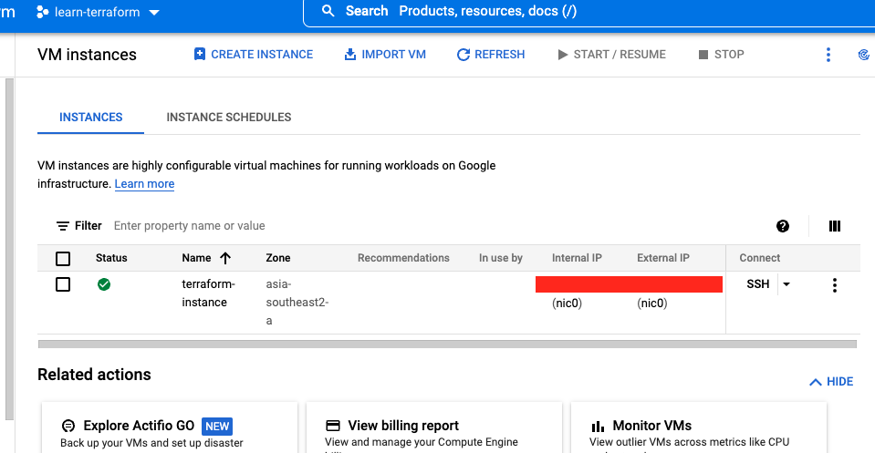
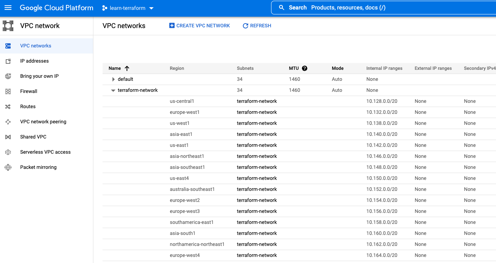

# Build Infrastructure - Terraform GCP




This repo is to track learning terraform using
[https://learn.hashicorp.com/tutorials/terraform/google-cloud-platform-build?in=terraform/gcp-get-started](https://learn.hashicorp.com/tutorials/terraform/google-cloud-platform-build?in=terraform/gcp-get-started)

With additional read from main.tfvars

How to run :
- update location of your `credential.json`
- update your `main.tfvars`
- run: 
```
terraform apply -var-file="main.tfvars"
```

How to check terraform is applied or not :
- run:
```
terraform show
```
it will show resource info like this
```
# google_compute_instance.vm_instance:
resource "google_compute_instance" "vm_instance" {
    can_ip_forward       = false
    cpu_platform         = "Intel Skylake"
    current_status       = "RUNNING"
    deletion_protection  = false
    enable_display       = false
    guest_accelerator    = []
    id                   = "projects/learn-terraform/zones/asia-southeast2-a/instances/terraform-instance"
    instance_id          = "938485485868352307"
    label_fingerprint    = "fghfghfg="
    machine_type         = "f1-micro"
    metadata_fingerprint = "CXbaJIsjH7g="
    name                 = "terraform-instance"
    project              = "learn-terraform"
    self_link            = "https://www.googleapis.com/compute/v1/projects/learn-terraform/zones/asia-southeast2-a/instances/terraform-instance"
    tags_fingerprint     = "fghgfh="
    zone                 = "asia-southeast2-a"

    boot_disk {
        auto_delete = true
        device_name = "persistent-disk-0"
        mode        = "READ_WRITE"
        source      = "https://www.googleapis.com/compute/v1/projects/learn-terraform/zones/asia-southeast2-a/disks/terraform-instance"

        initialize_params {
            image  = "https://www.googleapis.com/compute/v1/projects/debian-cloud/global/images/debian-9-stretch-v20220519"
            labels = {}
            size   = 10
            type   = "pd-standard"
        }
    }

    network_interface {
        name               = "nic0"
        network            = "https://www.googleapis.com/compute/v1/projects/learn-terraform/global/networks/terraform-network"
        network_ip         = "10.123.0.2"
        queue_count        = 0
        stack_type         = "IPV4_ONLY"
        subnetwork         = "https://www.googleapis.com/compute/v1/projects/learn-terraform/regions/asia-southeast2/subnetworks/terraform-network"
        subnetwork_project = "learn-terraform"

        access_config {
            nat_ip       = "34.xxx.xxx.23"
            network_tier = "PREMIUM"
        }
    }

    scheduling {
        automatic_restart   = true
        min_node_cpus       = 0
        on_host_maintenance = "MIGRATE"
        preemptible         = false
        provisioning_model  = "STANDARD"
    }
}
# google_compute_network.vpc_network:
resource "google_compute_network" "vpc_network" {
    auto_create_subnetworks         = true
    delete_default_routes_on_create = false
    id                              = "projects/learn-terraform/global/networks/terraform-network"
    mtu                             = 0
    name                            = "terraform-network"
    project                         = "learn-terraform"
    routing_mode                    = "REGIONAL"
    self_link                       = "https://www.googleapis.com/compute/v1/projects/learn-terraform/global/networks/terraform-network"
}
```
 
How to stop :
- run:
```
terraform destroy -var-file="main.tfvars"
```